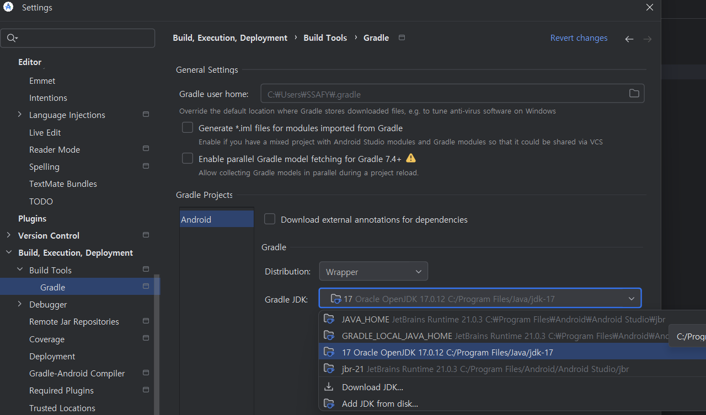
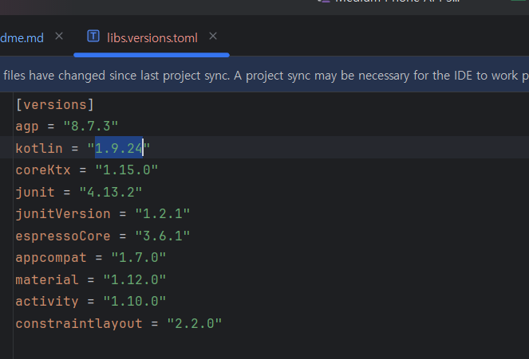
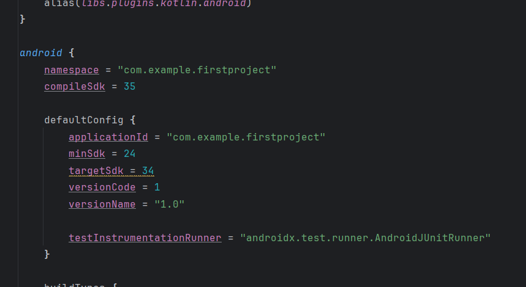
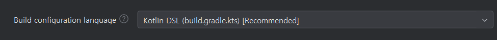
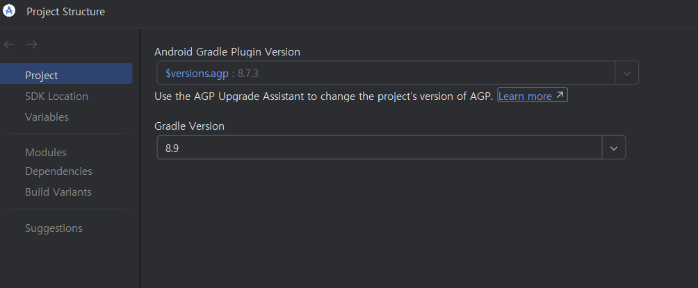

# Android 개발 폴더

## version Setting

1. JDK = Oracle OpenJDK 17.0.12
   

2. kotlin = 1.9.24
   

3. MinSDK = 24
   

4. Target SDK = 34

5. Compile SDK = 35

6. Gradle = Kotlin DSL
   

7. Gradle PlugIn Version = 8.7.3 -> 8.8.0

8. Gradle Version = 8.9 -> 8.10.2
   
